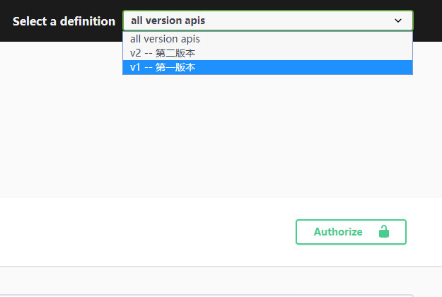
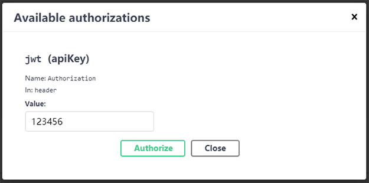
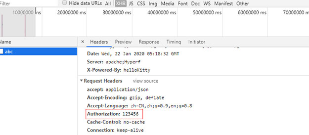
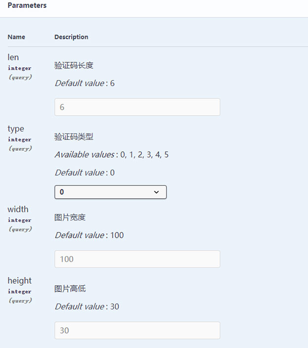
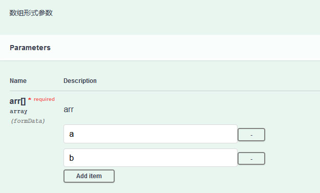
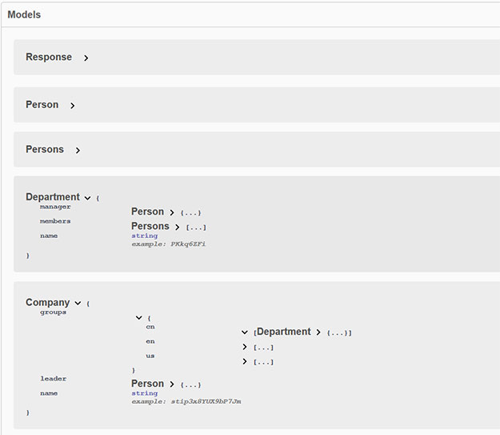

# hyperf-apihelper
hyperf api and swagger helper.   
它是一个[Hyperf](https://github.com/hyperf-cloud/hyperf)框架的 [**api接口自动验证和swagger接口文档生成**] 组件.  
功能包括：  
- 通过注解定义接口路由、请求方法和参数,并由中间件自动校验接口参数.
- 生成json文件,供swagger接口文档测试使用,可打开或关闭.
- swagger支持接口多版本分组管理.
- 支持restful path路由参数校验.
- 支持自定义响应体结构.
- 支持自定义多层级swagger model.
- 支持自定义前置动作.
- 支持自定义拦截动作.


### 0.安装
- nginx(或apache)指定站点目录为 BASE_PATH/public, swagger-ui将自动发布到该目录下
- 安装组件
```sh
# composer安装本组件
composer require kakuilan/hyperf-apihelper

# 发布组件初始化配置文件到你的项目下
php bin/hyperf.php vendor:publish kakuilan/hyperf-apihelper
```


### 1.配置
- 修改config/autoload/apihelper.php中的配置,将`host`改为你的域名,如test.com,则接口文档地址为test.com/swagger
- 修改config/autoload/middlewares.php中间件配置,如
```php
return [
    'http' => [
        Hyperf\Apihelper\Middleware\ApiValidationMiddleware,
    ],
];
```
- 修改config/autoload/exceptions.php异常处理配置,如
```php
return [
    'handler' => [
        'http' => [
            Hyperf\Apihelper\Exception\Handler\ValidationExceptionHandler::class,
            App\Exception\Handler\AppExceptionHandler::class,
        ],
    ],
];
```
- 修改config/autoload/dependencies.php依赖配置,如
```php
return [
    'dependencies' => [
        Hyperf\HttpServer\Router\DispatcherFactory::class => Hyperf\Apihelper\DispatcherFactory::class
    ],
];
```


### 2.使用
编辑控制器文件app/Controller/Test.php,如
```php
namespace App\Controller;

use Hyperf\Apihelper\Annotation\ApiController;
use Hyperf\Apihelper\Annotation\ApiResponse;
use Hyperf\Apihelper\Annotation\ApiVersion;
use Hyperf\Apihelper\Annotation\Method\Delete;
use Hyperf\Apihelper\Annotation\Method\Get;
use Hyperf\Apihelper\Annotation\Method\Patch;
use Hyperf\Apihelper\Annotation\Method\Post;
use Hyperf\Apihelper\Annotation\Method\Put;
use Hyperf\Apihelper\Annotation\Param\Body;
use Hyperf\Apihelper\Annotation\Param\File;
use Hyperf\Apihelper\Annotation\Param\Form;
use Hyperf\Apihelper\Annotation\Param\Header;
use Hyperf\Apihelper\Annotation\Param\Path;
use Hyperf\Apihelper\Annotation\Param\Query;
use Hyperf\Apihelper\Controller\BaseController;
use Hyperf\Apihelper\Exception\ValidationException;

/**
 * @ApiController(tag="测试实例", description="测试例子")
 * @ApiVersion(group="v1", description="第一版本")
 */
class Test extends BaseController {

    /**
     * @Get(path="/user", description="获取用户详情")
     * @Query(key="id", rule="required|int|gt:0")
     * @Query(key="u", rule="required|active_url|trim")
     * @Query(key="t", rule="required|starts_with:a")
     * @Query(key="e", rule="required|trim|enum:e,f,g")
     * @Query(key="h", rule="trim|cb_chkHello")
     * @ApiResponse(code=200, schema={"$ref":"Response"})
     */
    public function get() {
        //失败
        //return self::doFail();

        //成功
        return self::doSuccess();
    }


    /**
     * @Patch(path="/info/{id}", description="路由参数测试")
     * @Path(key="id", rule="int|gt:0")
     * @ApiResponse(code=200, schema={"$ref":"Response"})
     */
    public function info() {
        $data = [
            'id' => $this->request->route('id'),
        ];
        return self::doSuccess($data);
    }


    /**
     * 检查输入字段
     * @param mixed $value 字段值
     * @param string $field 字段名
     * @param array $options 参数选项
     * @return array
     */
    public function chkHello($value, string $field, array $options): array {
        $res = [
            true,
            $value,
        ];
        if (!true) {
            $res = [
                false,
                '具体验证失败的信息',
            ];
        }

        return $res;
    }


    /**
     * @Get(description="生成验证码")
     * @Header(key="authorization|访问令牌", rule="required_without_all:access_token")
     * @Query(key="access_token|访问令牌", rule="required_without_all:authorization")
     * @Query(key="len|验证码长度", rule="int|gt:0|max:10|default:6")
     * @Query(key="type|验证码类型", rule="int|default:0|enum:0,1,2,3,4,5")
     * @Query(key="width|图片宽度", rule="int|gt:1|default:100")
     * @Query(key="height|图片高度", rule="int|gt:1|default:30")
     * @ApiResponse(code=200, schema={"$ref":"Response"})
     */
    public function create() {
        $len    = $this->request->query('len');
        $type   = $this->request->query('type');
        $width  = $this->request->query('width');
        $height = $this->request->query('height');

        return self::doSuccess();
    }


    /**
     * @Post(path="/arrparam", description="数组形式参数/多级参数")
     * @Form(key="arr", rule="required|array")
     * @Form(key="row", rule="object")
     * @Form(key="row.name", rule="required|string|trim")
     * @Form(key="row.age", rule="int|gt:0|default:1")
     * @Form(key="row.addr", rule="string|trim")
     * @ApiResponse(code=200, schema={"$ref":"Response"})
     */
    public function arrparam() {
        $post = $this->request->post();
        return self::doSuccess($post);
    }


    /**
     * @Post(path="/test/testbody", description="body测试")
     * @Body(rule="required|json|cb_parseBody")
     * @ApiResponse(code=200, schema={"$ref":"Response"})
     */
    public function testbody() {
        return self::doSuccess(date('Y-m-d H:i:s'));
    }


    /**
     * 自定义解析body数据
     * @param mixed $value 字段值
     * @param string $field 字段名
     * @param array $options 参数选项
     * @return array
     * @throws ValidationException
     */
    public function parseBody($value, string $field, array $options): array {
        $arr = json_decode($value, true);
        $res = [
            true,
            $value,
        ];

        //检查
        //        if (!isset($arr['hello'])) {
        //            $res = [
        //                false,
        //                'body必须包含hello字段',
        //            ];
        //            return $res;
        //        }

        //或者
        if (!isset($arr['world'])) {
            throw new ValidationException('body必须包含world字段');
        }

        return $res;
    }


    /**
     * @Post(path="/test/upload", description="上传测试")
     * @File(key="sec", rule="required|file|size:1000")
     * @File(key="img", rule="file|image")
     * @ApiResponse(code=200, schema={"$ref":"Response"})
     */
    public function upload() {
        $files = $this->request->getUploadedFiles();
        return self::doSuccess($files);
    }

    /**
     * 获取模型结构-结构名 Hello
     * @return array
     */
    public static function getSchemaHello(): array {
        return [
            'a' => false,
            'b' => 2,
            'c' => 'hello',
            'p' => '$Person',
        ];
    }

    /**
     * @Get(path="/test/persons", description="自定义响应模型-人员列表")
     * @ApiResponse(code=200, schema={"$ref":"TestPersons"})
     */
    public function persons() {
        $data = self::getDefaultDataBySchemaName('Persons');
        return self::doSuccess($data);
    }


    /**
     * @Get(path="/test/company", description="自定义响应模型-单个公司")
     * @ApiResponse(code=200, schema={"$ref":"TestCompany"})
     */
    public function company() {
        $data = self::getDefaultDataBySchemaName('Company');
        return self::doSuccess($data);
    }

}
```


### 3.验证规则
- 组件会先执行Hyperf官方规则,详见[hyperf validation](https://hyperf.wiki/#/zh-cn/validation)
- 再执行本组件的验证规则,包括:  
  - 转换器,有
    - default,将参数值设为指定的默认值
    - int/integer,将参数值转换为整型.注意:若未传该参数,则默认为intval(null)=0
    - float,将参数值转换为浮点数.注意:若未传该参数,则默认为floatval(null)=0
    - bool,将参数值转换为布尔型.注意:若未传该参数,则默认为boolval(null)=false ,其中字符串:  
        - 'false', 'null', 'nil', 'none', '0', '0.0' 将转换为`false`
        - 'true', '1' 将转换为`true`
    - trim,过滤参数值前后空格

  - 扩展规则,有
    - safe_password,检查是否安全密码
    - natural,检查是否自然数
    - cnmobile,检查是否中国手机号
    - cncreditno,检查是否中国身份证号
    - enum,检查参数值是否枚举值中的一个
    
  - 控制器验证方法.  
  若需要在控制器中执行比较复杂的逻辑去验证,则可以使用该方式.  
  如上例中的cb_chkHello,规则名以cb_开头,后跟控制器的方法名chkHello.  
  验证方法必须定义接受3个参数:$value, $field, $options;  
  返回结果必须是一个数组:  
  若检查失败,为[false, 'error msg'];若检查通过,为[true, $newValue],$newValue为参数值的新值.  
  形如:
    ```php
    public function fn($value, string $field, array $options): array
    ```


### 4.接口响应体
- #### 4.1默认响应体结构
    - 接口操作成功,返回{"status":true,"msg":"success","code":200,"data":[]}
    - 接口操作失败,返回{"status":false,"msg":"fail","code":400,"data":[]}
    - 自定义响应错误码code,可参考languages/zh_CN/apihelper.php

- #### 4.2自定义响应体结构
    若要自定义响应体结构,可以  
    - 首先修改config/autoload/apihelper.php中的base_controller配置,指定基本控制器,如  
    ```php
    'base_controller' => Hyperf\Apihelper\Controller\BaseController::class,
    ```
    
    - 然后基本控制器需要实现`Hyperf\Apihelper\Controller\ControllerInterface`接口.  
    包括以下几个静态方法:  
        - `getSchemaResponse(): array`,获取响应体结构,对应模型名称`Response`
        - `doSuccess($data = [], string $msg = 'success', array $result = []): array`,操作成功时响应
        - `doFail($code = '400', array $trans = []): array`,操作失败时响应
        - `doValidationFail(string $msg = ''): array`,执行验证失败时响应
    
    - 最后,基本控制器作为控制器的父类,所有的控制器必须继承自该类.  
    具体可参考`Hyperf\Apihelper\Controller\BaseController`.

- #### 4.3自定义多层级swagger model
    对接口响应的swagger结构模型生成,使用注解,如
    ```php
  @ApiResponse(code=200, schema={"$ref":"Response"})  
  ```
  其中`Response`为接口响应基本模型,由`getSchemaResponse()`方法定义.其他自定义接口响应模型的最外层结构,必须和它相同;非接口响应的一般数据模型,则无此要求.  
  这里说的"接口响应模型",是指使用@ApiResponse注解的、直接由接口输出的结构模型.  
  由于应用业务输出数据的多样性,本组件也支持自定义、多层级的模型,按如下规则:
  - 在控制器中使用`getSchema`为前缀,后跟驼峰规则的结构模型名称,组成的公共静态方法,形如
  ```php
  public static function getSchemaAbcXyz(): array
  ```
  - 则AbcXyz就是上述方法定义的模型名称,该方法必须返回一个数组,体现该模型的数据结构.
  - 若要在模型中引用另外一个模型,可以使用$符号来引用,进而实现模型间的嵌套,如
  ```php
    public static function getSchemaPerson(): array {
        return [
            'name'   => 'zhang3',
            'age'    => 24,
            'weight' => 64.5,
            'addr'   => 'home',
            'male'   => true,
        ];
    }

    // 使用$前缀引用其他结构,首字母大小写都可以(但建议大写),组件将会自动转换为首字母大写的驼峰名称.
    public static function getSchemaPersons(): array {
        return [
            '$person',
            '$Person',
            '$Person',
        ];
    }
  ```
  - 因此,$符号在自定义模型中是关键字,要谨慎使用.
  - 为了维护方便,建议所有的自定义模型都在同一个父级控制器中定义.本组件在`SchemaModel`中定义.若你在不同控制器中定义不同或相同的模型,也是允许的.不过要注意,因为模型名称是唯一的,本组件仅会使用最先扫描到的模型定义.
  - 为了测试,本组件内置的模型有`Response`,`Person`,`Persons`,`Department`,`Company`,`TestPersons`,`TestCompany`,你自定义的模型名称应避免和它们同名.
  - 强调下,自定义swagger模型和自定义响应体结构两者是不同的;swagger模型只是描述API接口文档的,而响应体结构则是接口的输出结果;若接口文档和接口输出有差异,则你应该要检查接口输出逻辑.
  - 具体可参考[2.使用](#2使用)的自定义响应模型部分代码,以及`Hyperf\Apihelper\Controller\SchemaModel`


### 5.自定义前置动作  
可以自定义控制器前置方法,每次在具体动作之前执行.  
该功能主要是数据初始化,将自定义的数据存储到request属性中,每次请求后销毁,避免控制器协程间的数据混淆.  
该方法必须严格定义，形如:  
```php
public function initialization(ServerRequestInterface $request): ServerRequestInterface
```
该方法不会中止后续具体动作的执行.  
方法名可以在config/autoload/apihelper.php中的`controller_antecedent`中指定,默认为initialization  
具体可参考`Hyperf\Apihelper\Controller\BaseController`.


### 6.自定义拦截动作
可以自定义控制器拦截方法,每次在具体动作之前执行.  
该功能主要是执行逻辑检查(如令牌或权限),当不符合要求时,中止后续具体动作的执行.  
该方法必须严格定义,形如:  
```php
public function interceptor(string $controller, string $action, string $route): mixed
```
若该方法返回非空的数组或字符串,则停止执行后续的具体动作.  
方法名可以在config/autoload/apihelper.php中的`controller_intercept`中指定,默认为interceptor  
具体可参考`Hyperf\Apihelper\Controller\BaseController`.


### 7.校验提示和数据获取
- #### 7.1校验参数提示
    - 配置开发环境提示具体参数错误  
    编辑apihelper.php配置,将`show_params_detail_error`设为true,  
    接口将显示具体字段验证规则的错误信息,方便前端调试.
    
    - 配置生产环境不提示具体参数错误  
    编辑apihelper.php配置,将`show_params_detail_error`设为false,  
    接口将隐藏具体字段验证信息,而仅提示"缺少必要的参数,或参数类型错误",减少外部安全攻击的可能.

- #### 7.2获取验证完的数据
    要获取具体参数,在控制器里面直接使用hyperf官方的方法去获取,如
    ```php
    $this->request->header('user-agent');
    $this->request->query('len');
    $this->request->post();
    $this->request->route('id');
    $this->request->getUploadedFiles();
    ```
    
    **注意:所有的参数都已经过校验处理,不再是原始的数据.**  
    若校验规则中包含有转换器,接收参数后,已经自动转换,无需再手工转换一次.如  
    - 校验规则中有trim,则' hello '会自动转为'hello'.
    - 校验规则中有int,则字符串'123'会自动转为整型123.


### 8.swagger生成

1.  api请求方法定义包括 `Get`, `Post`, `Put`, `Patch`, `Delete`
2.  参数定义包括 `Header`, `Query`, `File`, `Form`, `Body`, `Path`
3.  返回结果定义 `ApiResponse` ,json串,如{"status":true,"msg":"success","code":200,"data":[]}
4.  ApiVersion接口版本分组并不影响方法里面的实际绑定路由;它只是把控制器里面的接口,归入到某个swagger文件,以便查看.
5.  生产环境请将配置`output_json`修改为false,关闭swagger.

### 9.升级注意
- #### v0.1.7升级:  
    - config/autoload/apihelper.php的api配置新增`'base_controller' => \Hyperf\Apihelper\Controller\BaseController::class`项
    - 基本控制器Hyperf\Apihelper\BaseController已删除,将其替换为Hyperf\Apihelper\Controller\BaseController
    - ApiResponse::doSuccess方法已删除,替换为BaseController::doSuccess,或self::doSuccess
    - ApiResponse::doFail方法已删除,替换为BaseController::doFail,或self::doFail

- #### v0.2.3升级:  
    - `ControllerInterface::getResponseSchema`已改为`ControllerInterface::getSchemaResponse`
    - `BaseController::getResponseSchema`已改为`BaseController::getSchemaResponse`
    - 将你代码中引用到的`getResponseSchema`修改为`getSchemaResponse`

### 图例
  

  

  

  

  

  